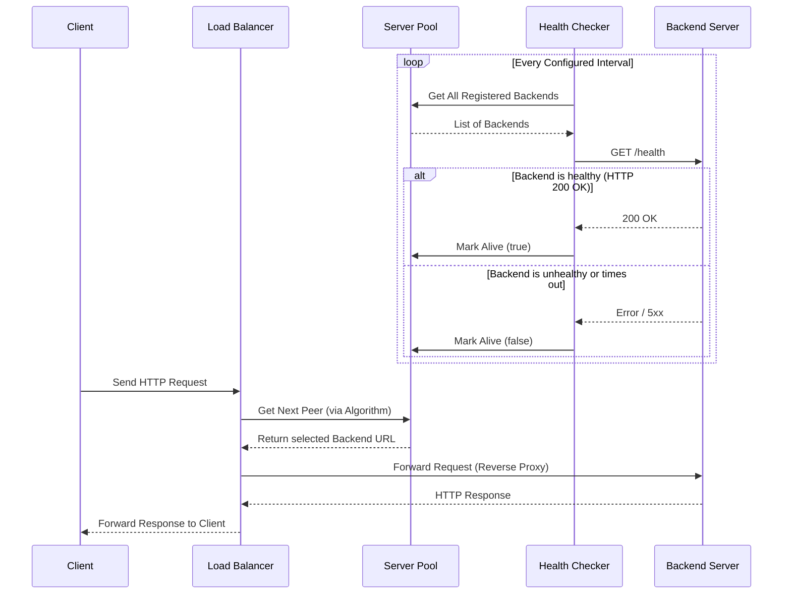

# Loadex

**A fast, observable, multi-algorithm load balancer written in Go.**

[](https://go.dev)
[](https://docker.com)
[](https://k6.io)
[](LICENSE)

---

`Loadex` is a HTTP load balancer written in Go. It features routing algorithms such as RoundRobin, WeightedRoundRobin, LeastConnection, and IpHash. It includes active connection tracking and supports monitoring using Prometheus and Grafana.

- **Routing Algorithms**: RoundRobin, WeightedRoundRobin, LeastConnection, and IpHash for efficient load distribution.
- **Active Health Checking**: Periodic health monitoring of backend servers with configurable intervals.
- **Automatic Failover**: Automatically routes traffic away from unhealthy servers.
- **Reverse Proxy**: Built on Go's `httputil.ReverseProxy` for efficient request forwarding.
- **Thread-Safe**: Uses mutexes and atomic operations for concurrent safety.
- **Monitoring and Observability Setup**: Pre-configured Grafana dashboards featuring request counts, P95/P99 latency histograms, and per-backend throughput.

---

## Why Loadex

Built for Learning & Practicing Production Patterns

Loadex was created to understand load balancers and to practice creating CLI tools with production-grade monitoring and testing. Unlike simple tutorials, Loadex includes production-ready features:

- **Real Fault Tolerance**: Survives server crashes with automatic redirection and retry mechanism.
- **Thread-Safe**: Concurrent-safe operations with mutexes.
- **Full Observability**: Prometheus metrics and Grafana dashboards.
- **Multiple Interfaces**: CLI, REST API and Web UI.
- **Production Features**: Health checks, monitoring, and multiple algorithms.

**Use Cases**:

- Small projects
- Learning backend systems concepts
- Interview project showcase

**Not Suitable For**:

- Large-scale production grade systems (use nginx or HAProxy)

## Features

**Interfaces**

- **CLI Tool** (`loadex`): Command-line administration for making requests and monitoring backend servers.
- **REST API**: Full HTTP/JSON API for programmatic management and health checking.

## Operations

- **Health Checks**: Active HTTP health checks to backend servers
- **Metrics**: Prometheus-compatible /metrics endpoint
- **Observability**: Docker Compose setup with Prometheus + Grafana
- **Tech Stack** : Go • Docker • Prometheus • Grafana

## Test Coverage

- **Unit Tests**: Full pattern and algorithm coverage.
- **E2E Integration Tests**: Verifies load distribution and system functionality.
- **Chaos Tests**: Simulates network partitions and unexpected failures.
- **Load Tests**: Evaluates concurrent operations handling.
- **Stress Tests**: Ensures 24-hour stability under high traffic.

## CI/CD Pipeline

Loadex uses GitHub Actions to ensure code quality and stability. Whenever a new Pull Request is raised or code is pushed to the `master` branch, the pipeline automatically:
1. **Checks out the code** and sets up the Go environment.
2. **Builds the project** to ensure no compilation errors are present.
3. **Runs the tests** (`make test`), executing the entire test suite, including race conditions and E2E verifications.

## Architecture

```text
       +--------+
       | Client |
       +--------+
           |
           v
+----------------------+
|                      |
|    Loadex     |
|                      |
+----------------------+
      /    |      \
     /     |       \
    v      v        v
 +----+  +----+   +----+
 | B1 |  | B2 |...| Bn |
 +----+  +----+   +----+
    Backend Servers
```

The Load Balancer consists of four main components

1. **ServerPool**: Manages a collection of backends and health map for tracking which backends are healthy and which are not
2. **Backend**: Represents a backend server with health status and connection tracking
3. **Health Checker**: Periodically checks backend health via HTTP health endpoints and updates the health map in the server pool
4. **Load Balancer**: Implements routing algorithms to distribute incoming traffic.

## 

## Algorithms

| Flag                         | Algorithm            | Description                                                                                                   |
| ---------------------------- | -------------------- | ------------------------------------------------------------------------------------------------------------- |
| `roundrobin` / `rr`          | RoundRobin           | Distributes incoming requests sequentially and evenly across all healthy backend servers.                     |
| `weightedroundrobin` / `wrr` | WeightedRoundRobin   | Distributes requests based on assigned server weights, allowing capable servers to handle more traffic.       |
| `leastconnection` / `lc`     | LeastConnection      | Dynamically routes traffic to the backend server with the lowest number of active connections.                |
| `iphash` / `ip`              | IpHash               | Provides consistent session routing by hashing the client's IP, ensuring the client hits the same backend.    |

## Installation

### Option A: With Docker. Full Stack (5 Backend Servers + Load Balancer + Prometheus + Grafana)

Start a 5-node backends with load balancer running round robin algorithm with Prometheus and Grafana monitoring:

```bash
docker compose up -d
```

### Running a Specific Algorithm

```bash
docker compose run --rm loadex /app/loadbalancer \
  -port 8080 \
  -algo leastconnection \
  -backends http://backend1:8001,http://backend2:8002
```

---

| Service       | URL                                   |
| ------------- | ------------------------------------- |
| Load Balancer | http://localhost:8080                 |
| Prometheus    | http://localhost:9090                 |
| Grafana       | http://localhost:3000 (admin / admin) |

Then **open Grafana → Dashboards → Golb Load Balancer** to see the live dashboard.

### Install the CLI (Loadex)

To interact with your cluster locally, install the CLI:

```bash
make install
```

This installs `loadex` to `$GOPATH/bin`. Make sure it's in your PATH:

```bash
export PATH="$(go env GOPATH)/bin:$PATH"
```

Verify installation:

```bash
loadex --help
```

### Use the CLI

Now you can interact with your load balancer:

```bash
# Check the health of all 5 registered backend servers
loadex health

# Simulate traffic by sending requests to the load balancer
loadex make-request --c 100

# Dynamically add a new backend server
loadex add-server --target http://localhost:8006

```

### View Metrics

Check out the monitoring stack:

- **Prometheus**: http://localhost:9090
- **Grafana**: http://localhost:3000 (login: admin/admin)

**Grafana Dashboard Preview**


### What You Have Now

A fully functional Load Balancer ecosystem with:

- A proxy routing traffic across backend nodes
- CLI tool (`loadex`) for operations and load testing
- Web dashboard (Grafana) for visual management
- Prometheus tracking requests, latencies, and backend health
- Automatic failover routing around unhealthy nodes

### Try It Out

```bash
# Run a load benchmark to see traffic distribution
loadex make-request -c 1000

# Kill one of the backend nodes
docker compose stop backend1

# Check the health map to see it marked as dead (wait for 5 seconds, health checker marks dead)
loadex health

# Run the benchmark again and observe that no traffic is routed to the killed backend
loadex make-request -c 1000
```

### Stop the Load balancer

When you're done:

```bash
docker compose down
```

### Option B: Build locally

```bash
# Build binaries
make build

# Or build manually
go build -o bin/loadbalancer ./cmd/loadbalancer
go build -o bin/loadex ./cmd/loadex
go build -o bin/backend ./cmd/backend

# Install to $GOPATH/bin
make install
```

Start the load balancer server and backend servers (you can add any backend server, just make sure they have a `/health` endpoint which returns an HTTP 200 OK or 503 Service Unavailable status code):

```bash
./bin/loadbalancer -backends http://localhost:8001,http://localhost:8002
```

If no algorithm is provided, it uses RoundRobin by default. To use a custom algorithm:

```bash
./bin/loadbalancer -backends http://localhost:8001,http://localhost:8002 -algo wrr
```

### HTTP/REST API

The Load Balancer exposes REST endpoints:

- **`GET /api/health`** - Retrieve a JSON map of all backend URLs and their health status.
- **`POST /api/add?url={TARGET_URL}`** - Add a new backend server to the server pool dynamically.
- **`GET /metrics`** - Prometheus metrics export endpoint.

**Make Targets**

```bash
make build          # Build binaries to ./bin/
make install        # Install to $GOPATH/bin
make test           # Run all tests
make testsum        # Run tests using gotestsum
make test-e2e       # Run integration tests
make test-chaos     # Run chaos tests
make test-algo      # Run load balancing algorithm tests
make help           # Show all targets
```

## Observability

### Prometheus Metrics

| Metric                          | Type      | Labels                        |
| ------------------------------- | --------- | ----------------------------- |
| `golb_requests_total`           | Counter   | `method`, `status`, `backend` |
| `golb_request_duration_seconds` | Histogram | `method`, `status`, `backend` |

### Grafana Dashboard

Pre-provisioned at `observability/grafana-dashboard.json`. Panels:

- **P50 / P95 / P99 Latency** — smooth time-series with gradient fill
- **Throughput per Backend** — stacked RPS view
- **Load Distribution** — donut chart showing % traffic per backend
- **Error Rate** — 5xx rate per backend

**Grafana Dashboard Preview**


---

## Configuration

### 1. Weighted Round Robin

In order to edit the weight assignment of the WeightedRoundRobin algorithm, modify this function in `load_balancers/weighted_round_robin.go`:

**Assign Custom Weights**
```go
func NewWeightedRoundRobin(pool *pool.ServerPool) *WeightedRoundRobin {
	serverURLs := pool.GetServers()
	weightMap := map[string]int{}

	invert := 2
	for _, url := range serverURLs {
		weightMap[url] = invert
		invert = 3 - invert
	}

	return &WeightedRoundRobin{
		serverPool:       pool,
		weightMap:        weightMap,
		currentServerIdx: 0,
		currentReqCount:  0,
	}
}
```

### 2. IP Hash

In order to edit the calculated hash from a request, modify this function in `load_balancers/ip_hash.go`:

```go
func calculateHash(r *http.Request) uint32 {
	srcIPPort := r.RemoteAddr
	srcIP, _, err := net.SplitHostPort(srcIPPort)
	if err != nil {
		srcIP = srcIPPort
	}

	var destIPPort string
	if localAddr := r.Context().Value(http.LocalAddrContextKey); localAddr != nil {
		destIPPort = localAddr.(net.Addr).String()
	} else {
		destIPPort = r.Host
	}
	hashKey := fmt.Sprintf("%s-%s", srcIP, destIPPort)

	h := fnv.New32a()
	h.Write([]byte(hashKey))
	hashValue := h.Sum32()
	return hashValue
}
```

### 3. Health Checker

In order to modify the duration of the health checker, edit this line in `cmd/loadbalancer/main.go`:

```go
const (
	HEALTH_CHECK_PERIOD = 5 * time.Second
)
```

## Project Structure

```
loadex/
├── cmd/
│   ├── backend/        # Dummy backend HTTP server
│   ├── loadbalancer/   # Main LB server (proxy + admin API)
│   └── loadex/         # CLI tool (Cobra)
├── load_balancers/     # RR, WRR, LC, IPHash algorithms + tests
├── health_checker/     # Active HTTP health check loop
├── server_pool/        # Thread-safe backend registry
├── observability/      # Prometheus metrics, Grafana provisioning
├── k6/                 # k6 load test script
├── scripts/            # Demo scripts (bash + PowerShell)
├── Dockerfile
├── docker-compose.yml
└── Makefile
    ReadMe              <--- You're here
```

---

---

## How It Works

- **Request Routing**: When a request arrives, the load balancer selects the next healthy backend using the selected algorithm.
- **Connection Tracking**: Active connections are incremented when a request is forwarded and decremented when the response is received.
- **Health Monitoring**: A background goroutine periodically checks each backend's `/health` endpoint.
- **Failover**: Unhealthy backends are automatically excluded from the rotation until they recover.

### Request Flow and Health Checks (Sequence Diagram)



## Logging

The load balancer logs:

- Backend addition events
- Health check start/status
- Backend health status (up/down)
- Proxy errors
- Server startup information

## Error Handling

- **No Healthy Backends**: Returns `HTTP 502 Bad Gateway` with an error message.
- **Invalid Backend URLs**: Fails to start with a fatal error.
- **Proxy Errors**: Logs errors and returns `502` to the client.

## Thread Safety

The implementation uses:

- `sync.RWMutex` for read/write locks on shared data structures.
- `sync/atomic` for lock-free operations on connection counters and indices.
- Goroutines for concurrent health checks.

---

## Contributing

Contributions are welcome! If you'd like to help improve Loadex, please follow these steps:

1. Fork the repository and create your feature branch: `git checkout -b feature/my-new-feature`
2. Commit your changes: `git commit -am 'Add some feature'`
3. Ensure your code satisfies the established tests: `make test` or `make testsum`
4. Push to the branch: `git push origin feature/my-new-feature`
5. Submit a pull request.

## License

MIT — see [LICENSE](LICENSE)
